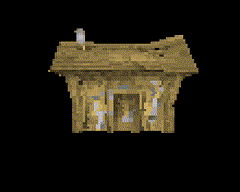
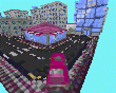
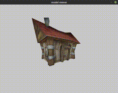
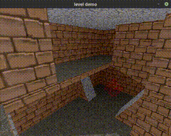
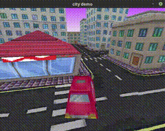

# small3dlib

Public domain 3D software rasterizer for (not only) resource-limited computers.

If you like this, you may also like my similar project: [raycastlib](https://gitlab.com/drummyfish/raycastlib). These two libraries can very easily be combined together -- here is a proof-of-concept gif (environment rendered with raycastlib, cubes with small3dlib):

## eye-candy previews

Pokitto (32bit embedded console, 48 MHz, 36 kB RAM):

Gamebuino META (Arduino 32bit console, 48 MHz, 32 kB RAM):

PC (SDL, offline rendering, terminal):

## features

- Very **fast, small and efficient**, runs even on tiny embedded with just megahertz CPUs and kilobytes of RAM.
- Uses **only 32bit integer math**, NO float, with a compile time option to use wider types if needed.
- **No dependencies** (uses only stdint standard library, NO stdio), extremely portable.
- **Single header**, KISS, suckless. No OOP, no design patterns, just nicely documented functions.
- **No dynamic heap allocation.**
- **Pure C99**, tested to run as C++ as well.
- Still **flexible** -- pixels are left for you to draw in any way you want with a custom fragment-shader like function.
- **Perspective correction**, 3 modes: none (linear only), full (per-pixel), approximation (per-N-pixels). 
- **Different drawing strategies** to choose from: none, z-buffer (none, full, reduced), triangle sorting (back-to-front, fron-to-back with stencil buffer).
- Triangles provide **barycentric coordinates**, thanks to which practically anything that can be achieved with OpenGL can be achieved (texturing, shading, normal-mapping, texture fitering, transparency, PBR, shadow mapping, MIP mapping, ...).
- **Different near plane coliision handling strategies**, several options: cull, push, geometrically correct clip, geometrically and barycentric correct clip. Choose the one that best suits you program.
- **Top-left rasterization rule**, pixels of adjacent triangles don't overlap or have holes (just like in OpenGL).
- **Tested on many platforms**:
  - PC (little endian, 64bit GNU)
  - PowerPC emulator (big endian)
  - compilers: gcc, clang
  - Arduboy (only experimental)
  - Pokitto (32 bit resource-limited, ~80 MHz CPU, 32 kB RAM)
  - Gamebuino META (32bit resource-limited embedded ARM)
  - TODO:
    - Android
    - Windows
    - emscripten (web browser, JavaScript transpile)
- **Extremely portable** due to no dependencies, no float, no build systems, low HW requirements, endian independence etc.
- **Many compile-time options** to tune the performance vs quality.
- **Similar to OpenGL** in principle, but simpler, easier to use, with higher-level features.
- **Tools** (Python scripts) for converting 3D models and textures to C array format used by the library.
- **Well commented** and formatted code. Automatic documentation (comments + provided Doxyfile).
- Completely **free of legal restrictions**, public domain, do literally anything you want.

**NOTE**: Backwards compatibility isn't a goal of this libraray. It is meant to
be an as-is set of tools that the users is welcome to adjust for their
specific project. So new features will be preferred to keeping the same
interface.

## why?

You just need to make a small mini 3D game, quick 3D animation or visualization and don't want to go through the horror of learning and setting
up OpenGL or Vulkan, installing drivers, learning complex APIs and libraries? Don't want to be tied to HW, 3rd party API or libraries and their
dependencies? Don't want to install gigabytes of heavy super ultra graphics engines just to play around with a few low poly models? You need a
simple software renderer as a fallback to your main renderer? You want to create extremely portable 3D graphics that will run on small obscure
embedded platforms that don't have OpenGL, good specs, FPU unit or even standard C library? Want to just render something offline simply without
caring about highest rendering speed? You want to toy around with modifying something in the rendering pipeline that you can't easily do or debug
in big frameworks (such as the rasterization algorithm)? Want to hack around in the demo scene? Want to create something public domain and need a
public domain renderer? Or just don't want to be bothered by conditions such as proper attribution or copyleft? You want to create an authentic
retro wobbly PS1 style graphics? Then this library may help you.

## limitations

And advantages at the same time :)

- **No scenegraph** (object parenting), just a scene list. Parenting can still be achieved by using cutom transform matrices.
- Though performance is high, due to multiplatformness it **probably can't match platform-specific rasterizers written in assembly**.
- There is **no far plane**.
- There is **no subpixel accuracy** (PS1 style graphics).
- There is **no antialiasing**, but you can still achieve it by supersampling (render in higher resolution and downscale) or filters like FXAA.
- At the moment there is no wireframe rendering, but you can simulate it easily (see model viewer example), or write it by hand (drawing lines is not that hard).
- Due to the limitations of using only integer arithmetics, some types of movement (particularly camera) **may look jerky, and artifact may appear** in specific situations. This can partially be fixed with `S3L_USE_WIDER_TYPES`.
- There's no extensive error and memory safety checking, you're supposed to not try to crash the library.

## how to use

For start take a look at the [helloWorld.c](programs/helloWorld.c) program and other examples.

For more see the other examples and **the library code itself**, it is meant to be self-documenting -- you'll find the description of a lot of things at the start of the file.

The basic philosophy is:

- The library implements only a rendering back-end, it doesn't perform any drawing to the actual screen itself,
  hence there is no dependency on any library such as OpenGL or SDL. It just calls your front-end function
  and tells you which pixels you should write. How you do it is up to you.
- Before including the header, define `S3L_PIXEL_FUNCTION` to the name of a function you will use to
  draw pixels. It is basically a fragment/pixel shader function that the library will call. You will
  be passed info about the pixel and can decide what to do with it, so you can process it, discard it,
  or simply write it to the screen.
- Also init screen resolution, either by defining `S3L_RESOLUTION_X` and `S3L_RESOLUTION_Y` (before including the library) or by setting `S3L_resolutionX` and `S3L_resolutionY` variables.
- Use the provided Python tools to convert your models and textures to C arrays, include them in your
  program and set up the scene struct.
- Init the 3D models and the scene with provided init functions (`S3L_init*`), set the position of the camera.
- Call `S3L_newFrame` to prepare for rendering, then call `S3L_drawScene` on the scene to perform the frame rendering.
  This will cause the library to start rendering and calling the `S3L_PIXEL_FUNCTION` in order to draw the frame. You can of course
  modify the function or write a similar one of your own using the more low-level functions which are
  also provided.
- Fixed point arithmetics is used as a principle, but there is no abstraction above it, everything is simply
  an integer (`S3L_Unit` type). The space is considered to be a uniform dense grid of discrete points, and what would normally be
  a 1.0 float value is an int value equal to `S3L_FRACTIONS_PER_UNIT` units. Numbers are normalized by this
  constant, so e.g. the sin function returns a value from `-S3L_FRACTIONS_PER_UNIT` to `S3L_FRACTIONS_PER_UNIT`. You have to
  pass numbers of this format to the library functions, but of course you may chooe to use floats in other places of your program.

## tips/troubleshooting

- Don't forget to **compile with -O3!** This drastically improves performance.
- Your pixel drawing function (`S3L_PIXEL_FUNC`) will mostly be the performance bottleneck, try to make it as fast as possible. The number of pixels is usually much higher than the number of triangles or vertices processed, so you should focus on pixels the most.
- In your `S3L_PIXEL_FUNC` **use a per-triangle cache!** This saves a lot of CPU time. Basically make sure you don't compute per-triangle values per-pixel, but only once, with the first pixel of the triangle. You can do this by remembering the last `triangleID` and only recompute the value when the ID changes. See the examples for how this is done.
- Some things, such as screen resolution, can be specified as static (compile time, can't change during run time) or dynamic. If you can, prefer setting them to static and a power of two (e.g. `#define S3L_RESOLUTION_X 512`) to increase performance!
- Seeing buggy triangles flashing in front of the camera? With the limited 32bit arithmetic far-away things may be overflowing. Try to scale down the scene. If you also don't mind it, set `S3L_STRICT_NEAR_CULLING` to `1` -- this should probably solve it.
- Seeing triangles weirdly deform in front of the camera? Due to the lack of proper near plane culling one of the options (`S3L_STRICT_NEAR_CULLING == 0`) deals with this by pushing the vertices in front of the near plane. To fix this either manually subdivide your model into more triangles or turn on `S3L_STRICT_NEAR_CULLING` (which will however make the close triangles disappear). 
- Seeing triangles disappear randomly in sorted modes? This is because the size of the memory for triangle sorting is limited by default -- increase `S3L_MAX_TRIANGLES_DRAWN`.
- Sorted mode sorts triangles before drawing, but sometimes you need to control the drawing order more precisely. This can be done by reordering the objects in the scene list or rendering the scene multiple times without clearing the screen.

## license

Everything in this repository is CC0 1.0 (public domain, https://creativecommons.org/publicdomain/zero/1.0/) + a waiver of all other IP rights (including patents and trademarks). 

I've written the code completely myself, from scratch. The art used in demos is either my own released under CC0 or someone else's released under CC0.

This project is made out of love and to be truly helpful to everyone, not for any self interest. I want it to forever stay completely in the public domain, not owned by anyone.

This is not mandatory but please consider supporting free software and free culture by using free licenses and/or waivers.

If you'd like to support me or just read something about me and my projects, visit my site: [www.tastyfish.cz](http://www.tastyfish.cz/).
