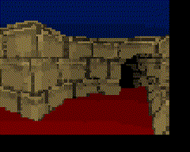
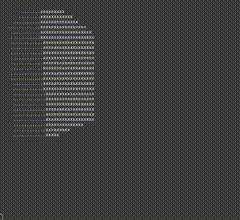
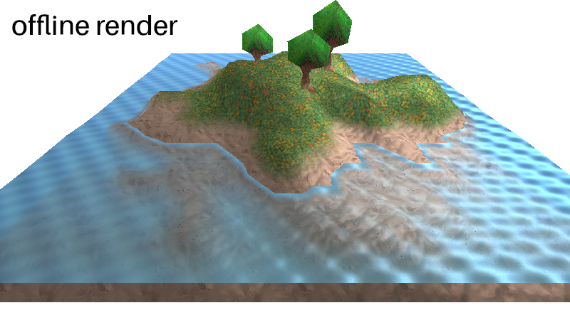
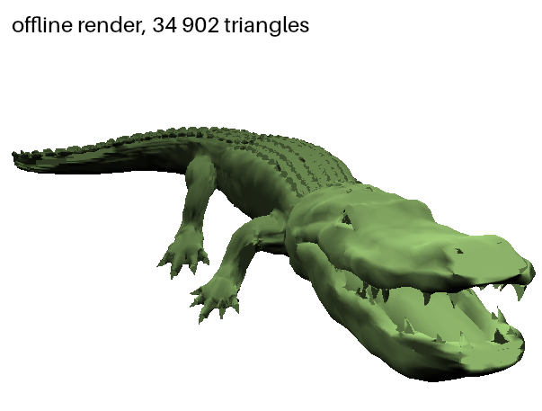

# small3dlib

Public domain 3D software rasterizer for (not only) resource-limited computers.

If you like this, you may also like my similar project: [raycastlib](https://gitlab.com/drummyfish/raycastlib).

## eye-candy previews

Pokitto (32bit embedded console, 48 MHz, 36 kB RAM):

PC (SDL, offline rendering, terminal):

## features

- Very **fast, small and efficient**.
- Uses **only integer math** (32bit).
- **No dependencies** (uses only stdint standard library), extremely portable.
- **Single header**, KISS.
- **Pure C99**, tested to run as C++ as well.
- Still **flexible** -- pixels are left for you to draw in any way you want with a custom fragment-shader like function.
- **Perspective correction**, 3 modes: none (linear only), full (per-pixel), approximation (per-N-pixels). 
- **Different drawing strategies** to choose from: none, z-buffer (none, full, reduced), triangle sorting (back-to-front, fron-to-back with stencil buffer).
- Triangles provide **barycentric coordinates**, thanks to which practically anything that can be achieved with OpenGL can be achieved (texturing, shading, normal-mapping, texture fitering, transparency, PBR, shadow mapping, MIP mapping, ...).
- **Tested on multiple platforms** (TODO).
- **Many compile-time options** to tune the performance vs quality.
- **Similar to OpenGL** in principle, but simpler, easier to use, with higher-level features.
- **Tools** (Python scripts) for converting 3D models and textures to C array format used by the library.
- **Well commented** and formatted code. Automatic documentation (comments + provided Doxyfile).
- Completely **free of legal restrictions**, do literally anything you want.

**NOTE**: Backwards compatibility isn't a goal of this libraray. It is meant to
be an as-is set of tools that the users is welcome to adjust for their
specific project. So new features will be preferred to keeping the same
interface.

## limitations

- Some values, like screen resolution, are a compile-time option due to performance and simplicity, and **can't change during runtime**.
- **No scenegraph** (object parenting), just a scene list. Parenting can still be achieved by using cutom transform matrices.
- Though performance is high, due to multiplatformness it **probably can't match platform-specific rasterizers written in assembly**.
- There is **no far plane**.
- There is **no subpixel accuracy**.
- There is a near plane, but a **proper culling by it (subdividing triangles) is missing**. You can either cull whole triangles completely or "push" them by the near plane. These options are okay when drawing a models not very close to the camera, but e.g. 3D environments may suffer from artifacts.
- Due to the limitations of 32bit integer arithmetics, some types of movement (particularly camera) **may look jerky, and artifact may appear** in specific situations.

## how to use

For start take a look at the [helloTerminal.c](https://gitlab.com/drummyfish/small3dlib/blob/master/programs/helloTerminal.c) program. It is only a little bit more complex than a simple hello world.

For more see the other examples and **the library code itself**, it is meant to be self-documenting -- you'll find the description of a lot of things at the start of the file.

The basic philosophy is:

- The library implements only a rendering back-end, it doesn't perform any drawing to the actual screen,
  hence there is no dependency on any library such as OpenGL or SDL. It just calls your front-end function
  and tells you which pixels you should write. How you do it is up to you.
- Before including the header, define `S3L_PIXEL_FUNCTION` to the name of a function you will use to
  draw pixels. It is basically a fragment/pixel shader function that the library will call. You will
  be passed info about the pixel and can decide what to do with it, so you can process it, discard it,
  or simply write it to the screen.
- Also define `S3L_RESOLUTION_X` and `S3L_RESOLUTION_Y` to the resolution of your rendering screen.
- Use the provided Python tools to convert your model and textures to C arrays, include them in your
  program and set up the scene struct.
- Call `S3L_drawScene` on the scene to perform the frame rendering. This will cause the
  library to start calling the `S3L_PIXEL_FUNCTION` in order to draw the frame. You can of course
  modify the function or write a similar one of your own using the more low-level functions which are
  also provided.
- Fixed point arithmetics is used as a principle, but there is no abstraction above it, everything is simply
  an integer (`S3L_Unit` type). The space is considered to be a dense grid, and what would normally be
  a 1.0 float value is an int value equal to `S3L_FRACTIONS_PER_UNIT` units. Numbers are normalized by this
  constant, so e.g. the sin function returns a value from `-S3L_FRACTIONS_PER_UNIT` to `S3L_FRACTIONS_PER_UNIT`.

## tips/troubleshooting

- Don't forget to **compile with -O3!** This drastically improves performance.
- Your pixel drawing function (`S3L_PIXEL_FUNC`) will mostly be the performance bottleneck, try to make it as fast as possible. The number of pixels is usually much higher than the number of triangles or vertices processed, so you should focus on pixels the most.
- In your `S3L_PIXEL_FUNC` **use a per-triangle cache!** This saves a lot of CPU time. Basically make sure you don't compute per-triangle values per-pixel, but only once, with the first pixel of the triangle. You can do this by remembering the last `triangleID` and only recompute the value when the ID changes. See the examples for how this is done.
- Seeing buggy triangles flashing in front of the camera? With the limited 32bit arithmetic far-away things may be overflowing. Try to scale down the scene. If you also don't mind it, set `S3L_STRICT_NEAR_CULLING` to `1` -- this should probably solve it.
- Seeing triangles weirdly deform in front of the camera? Due to the lack of proper near plane culling one of the options (`S3L_STRICT_NEAR_CULLING == 0`) deals with this by pushing the vertices in front of the near plane. To fix this either manually subdivide your model into more triangles or turn on `S3L_STRICT_NEAR_CULLING` (which will however make the close triangles disappear). 
- Seeing triangles disappear randomly in sorted modes? This is because the size of the memory for triangle sorting is limited by default -- increase `S3L_MAX_TRIANGLES_DRAWN`.
- Sorted mode sorts triangles before drawing, but sometimes you need to control the drawing order more precisely. This can be done by reordering the objects in the scene list or rendering the scene multiple times without clearing the screen.

## license

Everything is CC0 1.0 + a waiver of all other IP rights (including patents). The art used in demos is either my own released under CC0 or someone else's released under CC0.

Please support free software and free culture by using free licenses and/or waivers.

If you'd like to support me or just read something about me and my projects, visit my site: [www.tastyfish.cz](http://www.tastyfish.cz/).
